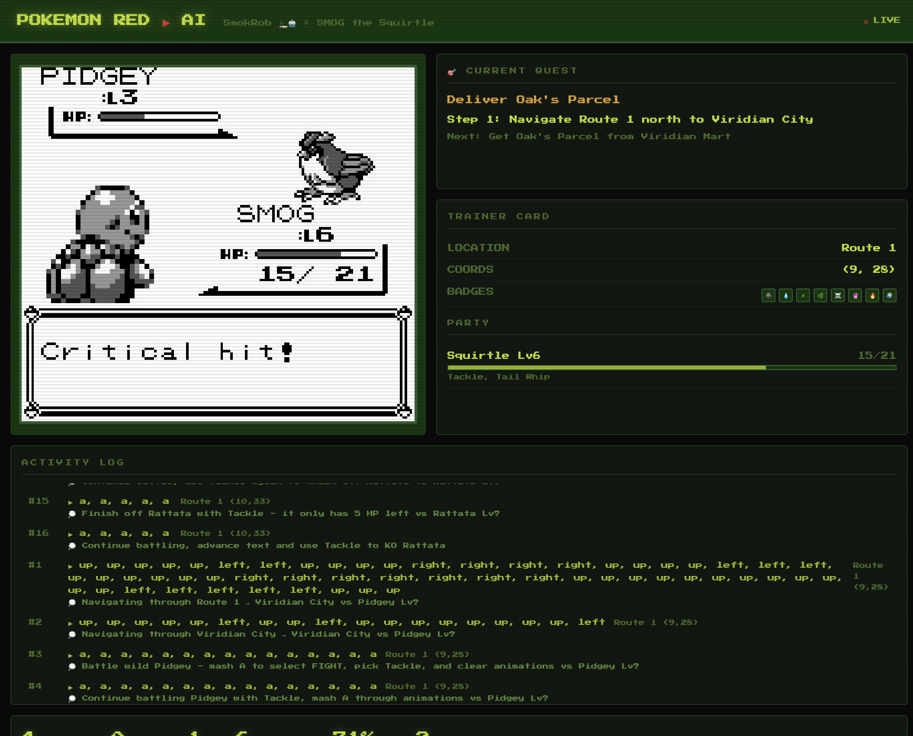

# 🎮 Pokemon OpenClaw

An OpenClaw skill that lets AI agents play Pokemon Red autonomously.



## How It Works

```
┌─────────────────────────────────────────────┐
│              OpenClaw Agent                  │
│  (Claude/GPT — the player's brain)          │
│                                              │
│  1. See screenshot + game state              │
│  2. Decide what buttons to press             │
│  3. Execute button presses                   │
│  4. Repeat                                   │
└──────────────┬──────────────────┬────────────┘
               │                  │
          screenshot         buttons
               │                  │
        ┌──────┴──────────────────┴──────┐
        │         PyBoy Emulator          │
        │    (headless Game Boy)           │
        │                                  │
        │  • Pokemon Red ROM               │
        │  • Memory reading (state)        │
        │  • Screenshot capture            │
        │  • Button input                  │
        └──────────────────────────────────┘
```

The key insight: **the OpenClaw agent IS the LLM**. Unlike other projects that call an external API, the agent directly analyzes screenshots and makes decisions. No separate API calls needed.

## Quick Start

```bash
# Clone
git clone https://github.com/YOUR_USERNAME/pokemon-openclaw.git
cd pokemon-openclaw

# Setup
python3 -m venv .venv
source .venv/bin/activate
pip install pyboy pillow

# Place your legally obtained Pokemon Red ROM here
cp /path/to/PokemonRed.gb .

# Test
python scripts/game.py PokemonRed.gb --screenshot --state --frames 300
```

## What the AI Sees

Each turn, the agent gets:

**Screenshot** — The actual game screen (160x144 pixels)

**Structured State** (read from RAM):
```
📍 Location: Pallet Town (5, 6) facing down
🏅 Badges: 0/8 — None
💰 Money: ¥3000
🎮 Party (1 Pokemon):
  • Squirtle Lv5 [20/20HP] OK — Tackle(35pp), Tail Whip(30pp)
```

**Recent History** — Last 10 actions and reasoning

## Features

- **Headless** — No GUI needed, runs anywhere
- **Memory Reading** — Structured game state from RAM (position, party, badges, battle)
- **Save States** — Checkpoint at milestones, resume anytime
- **Multi-button Sequences** — Efficient movement (fewer API calls)
- **Stuck Detection** — Recognizes repeated screens and tries new approaches
- **Chat Integration** — Screenshots post to Signal/Discord/Telegram

## Project Structure

```
pokemon-openclaw/
├── SKILL.md              # OpenClaw skill definition
├── README.md             # This file
├── RESEARCH.md           # Research notes and references
├── scripts/
│   └── game.py           # PyBoy wrapper (emulator + memory + I/O)
├── prompts/
│   └── system.md         # AI gameplay strategy prompt
├── saves/                # Emulator save states
├── screenshots/          # Game screenshots
└── reference-*/          # Reference repo clones (gitignored)
```

## Requirements

- Python 3.10+
- PyBoy (`pip install pyboy`)
- Pillow (`pip install pillow`)
- Pokemon Red ROM (.gb) — legally obtained

## References

- [PyBoy](https://github.com/Baekalfen/PyBoy) — Python Game Boy emulator
- [Claude Plays Pokemon](https://github.com/LeePresswood/Claude-Plays-Pokemon) — Original concept
- [LLM-Pokemon-Red](https://github.com/martoast/LLM-Pokemon-Red) — Gemini variant
- [PokemonRedExperiments](https://github.com/PWhiddy/PokemonRedExperiments) — RL approach (7.8K stars)
- [Pokemon Red RAM Map](https://datacrystal.tcrf.net/wiki/Pokémon_Red/Blue:RAM_map) — Memory addresses

## License

MIT
